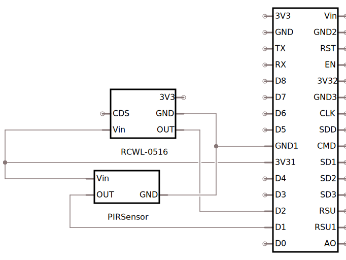

# Presence Sensor

## Introduction

So user `big_like_a_pickle` posted a pic on reddit of his project for creating a presence sensor that accounts for the flaws in a microwave presence and a PIR sensor. [Link](https://reddit.com/r/homeassistant/comments/ho5snd/my_8_diy_mqttenabled_occupancy_sensor_details_in/)

I liked the idea behind it and wanted to build my own. I didn't get the EXACT same PIR sensor, but ended up being able to make what I got work. I also, instead of coding up my own Arduino, leveraged [ESPHome](https://esphome.io/) to simplify the programming of it as well as its integration with HomeAssistant.

## Parts

 * [NodeMCU ESP8266](https://www.amazon.com/dp/B07HF44GBT/ref=cm_sw_r_cp_tai_-e7cFbWTFKKRT)
 * [PIR Sensor](https://www.amazon.com/dp/B07NPKMH58/ref=cm_sw_r_cp_tai_Bb7cFbS77JZG8)
 * [Microwave Motion Sensor](https://www.amazon.com/dp/B0732VQ4Q2/ref=cm_sw_r_cp_tai_Dd7cFbZZHF7YY)
 
## Diagram



## Programming

Since I went with the "easy" approach of ESPHome, it just means that I'll have to describe the interaction in YAML, plus integrating it with Home Assistant is as simple as pointing it at the IP Address that it gets assigned via the UI.

You'll want to pull this repo down via the `git clone` command to get started.

### The files

There are two files that are of concern for this project:

 * motion_common.yaml
 * sample.yaml

I modeled this after a template I'd found previously that really made integrating multiple of these types of devices easily. The `common` file allows you to have all of the things that can be shared written down once. In the `sample.yaml`, it just has to include the `motion_common.yaml` file and then you reference the unique aspects.

### Customizing

In the `motion_common.yaml` file, you _can_ update the SSID so that it automatically connects to your WiFi at start up. The `ap` configuration allows for a fallback in case the device is unable to connect to the configured SSID.

You do you, boo boo.

### Compiling and Uploading

To get this set up, you do not need the Arduino IDE, but you will need python:

```
pip install esphome
esphome upload --upload-port=<PATH_TO_USB_PORT> sample.yaml
```

## Home Assistant

You can leverage Home Assistant's built-in integration with [ESPHome](https://www.home-assistant.io/integrations/esphome/) to get this up quickly. That link will tell you all you need to know.

## TODO

I'm debating expanding this circuit and configuration to replace a wall switch sensor. This would require stepping down 110V to the required 5V, and I also think I'll use a different ESP8266 Board just to not have the micro USB in there.

Any suggestions are welcome.
